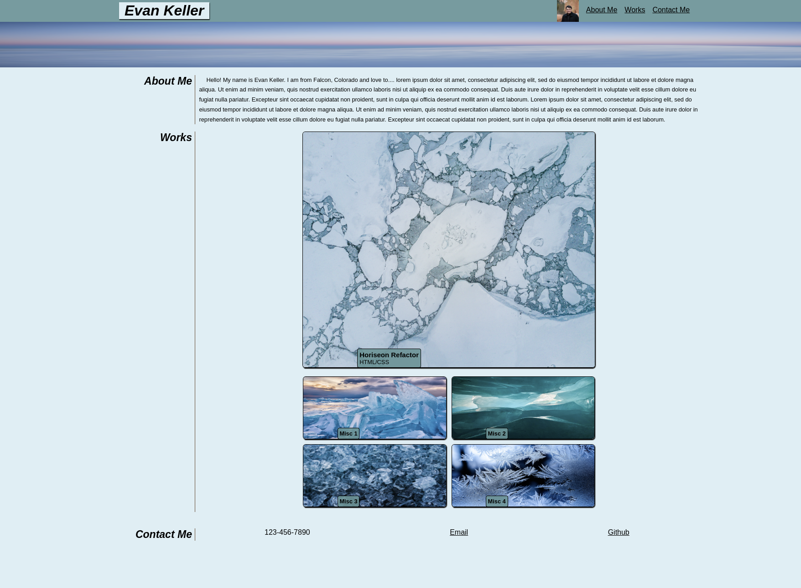

# Portfolio-EvanK

## Description

A portfolio website that presents information about Evan Keller. This information includes an about me, links to projects that he has worked on, and ways to contact him.

## Installation

N/A

## Usage

Webpage found at https://33649ek.github.io/Portfolio-EvanK/

Clicking on items in the navigation bar at the top right will scroll the page to the affiliated content on the page. There are images in the WORKS section that will link to the corresponding project when clicked on.

When the window is narrowed below 1034px, the formatting for headers and the image links will begin to change.
## Credits

All images in the works section were taken from https://unsplash.com. Some code in the style.css file was taken from https://www.w3schools.com/html/html5_semantic_elements.asp before being modified.

## License

MIT License